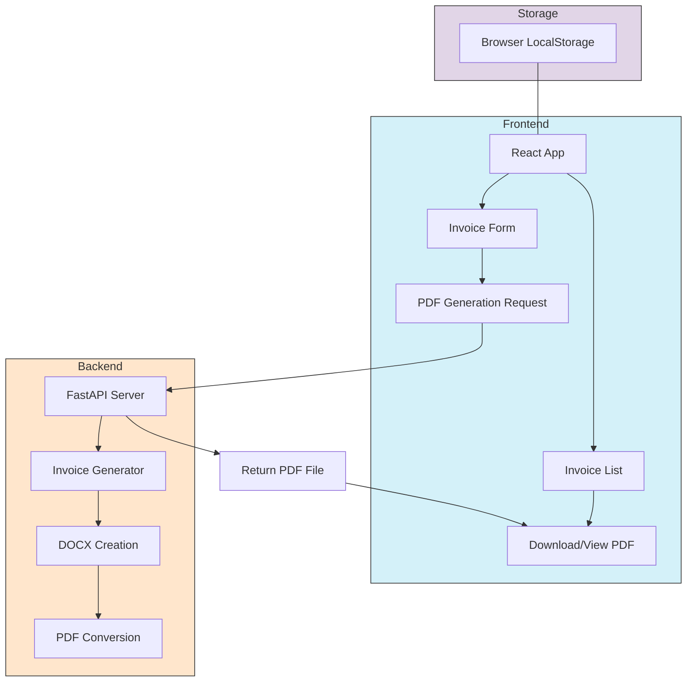

# Invoice Forge

Invoice Forge is a comprehensive invoice management application that allows freelancers and small businesses to create, manage, and generate professional PDF invoices. The application consists of a React TypeScript frontend and a Python FastAPI backend for PDF generation.

## Project Development

This project was developed using [Lovable](https://lovable.dev/projects/3b289a98-53da-4a25-acda-bc6e7bda85f8), an AI-assisted development platform. You can view the project on Lovable to see how it was built and make further modifications through the platform.

## Features

- **Create and Manage Invoices**: Easily create, edit, and delete invoices with a user-friendly interface
- **PDF Generation**: Generate professional PDF invoices using the Python backend
- **Custom Branding**: Add your company logo and choose from multiple PDF-compatible fonts
- **Invoice Tracking**: Track invoice status (Draft or PDF Generated)
- **Data Export/Import**: Export and import invoice settings using YAML format
- **Local Storage**: All invoices are saved in your browser's local storage
- **Service Details Tracking**: Track service dates and descriptions separately

## Project Structure

The project is divided into two main components:

### Frontend (React + TypeScript)
- Built with Vite, React, TypeScript, and Tailwind CSS
- Uses shadcn-ui for component styling
- Manages invoice data in local storage

### Backend (Python + FastAPI)
- Python-based REST API using FastAPI
- Generates PDF invoices from JSON data
- Converts DOCX documents to PDF using LibreOffice/unoconv

## System Architecture



## Installation and Setup

### Prerequisites
- Node.js (v16 or higher)
- npm or yarn
- Python 3.8 or higher
- pip (Python package manager)

### Frontend Setup

1. Clone the repository
```sh
git clone <repository-url>
cd invoice-forge
```

2. Install frontend dependencies
```sh
cd frontend
npm install
```

3. Start the development server
```sh
npm run dev
```

4. The frontend will be available at http://localhost:8080

Here is what the invoice creation form looks like:


### Backend Setup

1. Set up a Python virtual environment (recommended)
```sh
cd backend
python -m venv venv
source venv/bin/activate  # On Windows, use: venv\Scripts\activate
```

2. Install Python dependencies
```sh
pip install fastapi uvicorn pydantic python-docx pyyaml docopt
```

3. Install LibreOffice and unoconv (required for PDF generation)
```sh
# On macOS
brew install libreoffice unoconv

# On Ubuntu/Debian
sudo apt-get install libreoffice unoconv

# On Windows
# Download and install LibreOffice from https://www.libreoffice.org/download/
# Then install unoconv via pip: pip install unoconv
```

4. Start the backend server
```sh
cd backend
uvicorn invoice_generator_api:app --reload
```

5. The backend API will be available at http://localhost:8000
   - API documentation: http://localhost:8000/docs

## API Documentation

FastAPI includes automatic API documentation using Swagger UI and ReDoc:

- **Swagger UI**: Access interactive API documentation at http://localhost:8000/docs
  - This interface allows you to test API endpoints directly from the browser
  - View request/response models, required parameters, and response codes
  - Execute API calls with sample data

- **ReDoc**: A more readable documentation version at http://localhost:8000/redoc
  - Better for reading and understanding the API structure
  - Includes detailed descriptions of all endpoints and schemas

The documentation is automatically generated from the API code and includes:
- Endpoint descriptions and examples
- Request body schemas with validation rules
- Response models and status codes
- Authentication requirements (if applicable)

## Usage

1. **Creating an Invoice**:
   - Click "Create Invoice" to start a new invoice
   - Fill in the required fields (company name, client name, services, etc.)
   - Click "Save Invoice" to save as a draft, or "Generate PDF" to create a PDF

2. **Managing Invoices**:
   - View all invoices in the main dashboard
   - Click on the settings icon to edit, delete, or download an invoice
   - Filter and sort invoices using the search bar and column headers

3. **Customizing Templates**:
   - Choose from multiple PDF-compatible fonts
   - Upload your company logo
   - Adjust company information and bank details

4. **Importing/Exporting**:
   - Export invoice settings as YAML files
   - Import settings from YAML files for quick invoice creation
   - Use the example format to create your own templates

## Backend API Endpoints

- `GET /`: API root with basic information
- `GET /version`: API version information
- `GET /example-client`: Returns a test HTML client
- `POST /generate-invoice`: Generate and download invoice (DOCX or PDF)

## Development

This project was built with:

- **Frontend**: Vite, TypeScript, React, shadcn-ui, Tailwind CSS
- **Backend**: Python, FastAPI, python-docx, PyYAML

You can continue development in several ways:

1. **Through Lovable**: Visit the [Invoice Forge project on Lovable](https://lovable.dev/projects/3b289a98-53da-4a25-acda-bc6e7bda85f8) to make changes using AI-assisted development. Changes made via Lovable will be committed automatically to the repository.

2. **Direct code editing**: Clone the repository and make changes locally using your preferred IDE. Push changes back to the repository to keep everything in sync.

3. **GitHub Codespaces**: You can also use GitHub Codespaces to edit the project directly in your browser without setting up a local environment.

## License

This project is licensed under the MIT License - see the LICENSE file for details.
