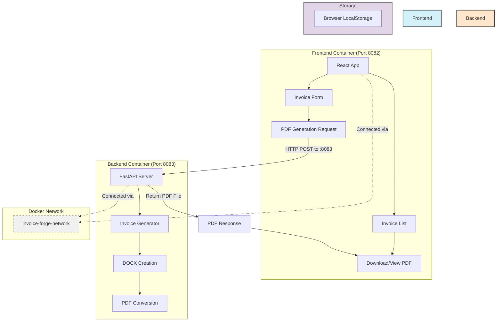

# Invoice Forge

Invoice Forge is a comprehensive invoice management application that allows freelancers and small businesses to create, manage, and generate professional PDF invoices. The application consists of a React TypeScript frontend and a Python FastAPI backend for PDF generation.

## Project Development

This project was developed using [Lovable](https://lovable.dev/projects/3b289a98-53da-4a25-acda-bc6e7bda85f8), an AI-assisted development platform. You can view the project on Lovable to see how it was built and make further modifications through the platform.

## Features

- **Create and Manage Invoices**: Easily create, edit, and delete invoices with a user-friendly interface
- **PDF Generation**: Generate professional PDF invoices using the Python backend
- **Custom Branding**: Add your company logo and choose from multiple PDF-compatible fonts
- **Invoice Tracking**: Track invoice status (Draft or PDF Generated)
- **Data Export/Import**: Export and import invoice settings using YAML format
- **Local Storage**: All invoices are saved in your browser's local storage
- **Service Details Tracking**: Track service dates and descriptions separately

## Project Structure

The project is divided into two main components:

### Frontend (React + TypeScript)
- Built with Vite, React, TypeScript, and Tailwind CSS
- Uses shadcn-ui for component styling
- Manages invoice data in local storage

### Backend (Python + FastAPI)
- Python-based REST API using FastAPI
- Generates PDF invoices from JSON data
- Converts DOCX documents to PDF using LibreOffice/unoconv

## System Architecture



## Installation and Setup

### Prerequisites
- Node.js (v16 or higher)
- npm or yarn
- Python 3.8 or higher
- pip (Python package manager)

### Frontend Setup

1. Clone the repository
```sh
git clone <repository-url>
cd invoice-forge
```

2. Install frontend dependencies
```sh
cd frontend
npm install
```

3. Start the development server
```sh
npm run dev
```

4. The frontend will be available at http://localhost:5173

**Note**: Both development and Docker deployment now use the same ports for consistency - frontend on 5173 (dev) or 8082 (Docker), backend on 8083 for both modes.

Here is what the invoice creation form looks like:


### Backend Setup

1. Set up a Python virtual environment (recommended)
```sh
cd backend
python -m venv venv
source venv/bin/activate  # On Windows, use: venv\Scripts\activate
```

2. Install Python dependencies
```sh
pip install fastapi uvicorn pydantic python-docx pyyaml docopt
```

3. Install LibreOffice and unoconv (required for PDF generation)
```sh
# On macOS
brew install libreoffice unoconv

# On Ubuntu/Debian
sudo apt-get install libreoffice unoconv

# On Windows
# Download and install LibreOffice from https://www.libreoffice.org/download/
# Then install unoconv via pip: pip install unoconv
```

4. Start the backend server
```sh
cd backend
uvicorn invoice_generator_api:app --reload --port 8083
```

5. The backend API will be available at http://localhost:8083
   - API documentation: http://localhost:8083/docs

## API Documentation

FastAPI includes automatic API documentation using Swagger UI and ReDoc:

- **Swagger UI**: Access interactive API documentation at http://localhost:8083/docs
  - This interface allows you to test API endpoints directly from the browser
  - View request/response models, required parameters, and response codes
  - Execute API calls with sample data

- **ReDoc**: A more readable documentation version at http://localhost:8083/redoc
  - Better for reading and understanding the API structure
  - Includes detailed descriptions of all endpoints and schemas

The documentation is automatically generated from the API code and includes:
- Endpoint descriptions and examples
- Request body schemas with validation rules
- Response models and status codes
- Authentication requirements (if applicable)

## Development Workflow

### Running Both Frontend and Backend in Development

For local development, you'll typically want to run both the frontend and backend servers simultaneously:

#### Terminal 1 - Backend Development Server
```bash
cd backend
python -m venv venv
source venv/bin/activate  # On Windows: venv\Scripts\activate
pip install fastapi uvicorn pydantic python-docx pyyaml docopt
uvicorn invoice_generator_api:app --reload --port 8083
```
Backend will be available at: http://localhost:8083

#### Terminal 2 - Frontend Development Server
```bash
cd frontend
npm install
npm run dev
```
Frontend will be available at: http://localhost:5173

### Frontend-Backend Connection in Development

The frontend development server (port 5173) is configured to connect to the backend server (port 8083). The frontend uses an endpoint configuration system where:

1. **Consistent Port Setup**: Both development and Docker use backend port 8083
2. **Endpoint Configuration**: Users can change the API endpoint via the frontend UI if needed
3. **Local Storage**: The endpoint setting is saved in browser local storage
4. **Environment Variables**: The frontend uses `VITE_API_URL` to determine the backend URL

### Development Scenarios

- **Frontend dev + Backend dev**: Frontend (5173) → Backend (8083)
- **Frontend dev + Backend Docker**: Frontend (5173) → Backend (8083) - *same port, seamless*
- **Frontend Docker + Backend dev**: Frontend (8082) → Backend (8083) - *requires Docker rebuild*
- **Full Docker**: Frontend (8082) → Backend (8083) - *automatic configuration*

### Benefits of Consistent Port Usage

- **No port switching**: Development and Docker use the same backend port (8083)
- **Simplified workflow**: No need to change endpoints when switching between dev and Docker
- **Consistent testing**: Same API URLs work in both environments

## Usage

1. **Creating an Invoice**:
   - Click "Create Invoice" to start a new invoice
   - Fill in the required fields (company name, client name, services, etc.)
   - Click "Save Invoice" to save as a draft, or "Generate PDF" to create a PDF

2. **Managing Invoices**:
   - View all invoices in the main dashboard
   - Click on the settings icon to edit, delete, or download an invoice
   - Filter and sort invoices using the search bar and column headers

3. **Customizing Templates**:
   - Choose from multiple PDF-compatible fonts
   - Upload your company logo
   - Adjust company information and bank details

4. **Importing/Exporting**:
   - Export invoice settings as YAML files
   - Import settings from YAML files for quick invoice creation
   - Use the example format to create your own templates

## Backend API Endpoints

- `GET /`: API root with basic information
- `GET /version`: API version information
- `GET /example-client`: Returns a test HTML client
- `POST /generate-invoice`: Generate and download invoice (DOCX or PDF)

## Deployment

Invoice Forge includes automated deployment capabilities using Terraform and Docker, supporting both local development and remote server deployments.

### Deployment Features

- **Dual Environment Support**: Deploy locally or to remote servers
- **Multi-Architecture Builds**: Support for both ARM64 (Apple Silicon) and AMD64 architectures
- **Automated Container Management**: Build, deploy, and manage both frontend and backend containers
- **Flexible Configuration**: Easy configuration through variables and tfvars files
- **Cleanup and Optimization**: Automatic cleanup of old resources and optimized deployment process

### Prerequisites

- Docker installed and running
- Terraform installed (>= 1.0)
- For remote deployment:
  - SSH access to remote server
  - Private key file for SSH authentication

### Quick Start

#### Local Deployment

1. Copy the example configuration:
```bash
cd terraform
cp terraform.tfvars.example terraform.tfvars
```

2. Edit `terraform.tfvars` for local deployment:
```hcl
environment = "local"
build_platform = "linux/amd64"  # or "linux/arm64" for Apple Silicon
```

3. Deploy:
```bash
terraform init
terraform apply -auto-approve
```

4. Access your application:
   - Frontend: http://localhost:8082
   - Backend: http://localhost:8083
   - Backend API docs: http://localhost:8083/docs

#### Remote Deployment

1. Configure `terraform.tfvars` for remote deployment:
```hcl
environment = "remote"
droplet_ip = "your-server-ip"
private_key_path = "/path/to/your/private/key"
api_url_remote = "http://your-server-ip:8083"
build_platform = "linux/amd64"
```

2. Deploy:
```bash
terraform apply -auto-approve
```

### Configuration Variables

| Variable | Description | Default | Required |
|----------|-------------|---------|----------|
| `environment` | Deployment environment (`local` or `remote`) | `"local"` | No |
| `backend_port` | Port for backend container | `8083` | No |
| `frontend_port` | Port for frontend container | `8082` | No |
| `build_platform` | Docker build platform | `"linux/amd64"` | No |
| `droplet_ip` | Remote server IP address | `""` | Yes (for remote) |
| `private_key_path` | Path to SSH private key | `""` | Yes (for remote) |
| `api_url_local` | API URL for local environment | `"http://localhost:8083"` | No |
| `api_url_remote` | API URL for remote environment | `""` | Yes (for remote) |

### Command Line Usage

#### Local Deployment with Command Line Variables
```bash
cd terraform
terraform apply -auto-approve \
  -var="environment=local" \
  -var="build_platform=linux/arm64"
```

#### Remote Deployment with Command Line Variables
```bash
cd terraform
terraform apply -auto-approve \
  -var="environment=remote" \
  -var="droplet_ip=YOUR_SERVER_IP" \
  -var="private_key_path=/path/to/key" \
  -var="api_url_remote=http://YOUR_SERVER_IP:8083"
```

### Port Configuration

The application uses the following port configuration:

#### Development Mode (Direct Node.js/Python)
- **Frontend**: http://localhost:5173 (Vite dev server)
- **Backend**: http://localhost:8083 (FastAPI with uvicorn)

#### Docker Deployment
- **Frontend**: http://localhost:8082 (nginx serving built React app)
- **Backend**: http://localhost:8083 (FastAPI in container)
- **Docker Network**: `invoice-forge-network` (internal container communication)

**Key Benefit**: Both development and Docker deployment use the same backend port (8083) for consistency. The frontend automatically connects to the correct backend URL through the `VITE_API_URL` environment variable.

### Architecture Support

#### Apple Silicon (M1/M2/M3)
```bash
cd terraform
terraform apply -var="build_platform=linux/arm64" -auto-approve
```

#### Intel/AMD or Remote x86 Servers
```bash
cd terraform
terraform apply -var="build_platform=linux/amd64" -auto-approve
```

### Deployment Process

#### Local Deployment
1. Cleanup old containers and images
2. Build backend and frontend images using buildx
3. Create Docker network
4. Start backend container with proper networking
5. Start frontend container with API URL configuration

#### Remote Deployment
1. Cleanup old containers and images locally
2. Build backend and frontend images using buildx
3. Save images to tar files
4. Copy tar files to remote server via SCP
5. Load images on remote server
6. Start containers with proper configuration and restart policies

### Troubleshooting

#### Check Container Status
```bash
docker ps
```

#### View Container Logs
```bash
docker logs invoice-forge-backend
docker logs invoice-forge-frontend
```

#### Check Images
```bash
docker images | grep invoice-forge
```

#### Clean Up Everything
```bash
cd terraform
terraform destroy -auto-approve
```

#### Manual Container Cleanup
```bash
docker rm -f invoice-forge-backend invoice-forge-frontend
docker rmi invoice-forge-backend:latest invoice-forge-frontend:latest
```

### Common Issues

1. **Build Platform Mismatch**: Ensure `build_platform` matches your target architecture
2. **SSH Connection Issues**: Verify `droplet_ip` and `private_key_path` are correct
3. **Port Conflicts**: Check if ports are already in use locally
4. **API URL Configuration**: Ensure `api_url_remote` is correctly set for remote deployments

### Terraform Commands Reference

- `terraform init`: Initialize Terraform and download providers
- `terraform plan`: Show execution plan without making changes
- `terraform apply`: Apply changes to create/update resources
- `terraform destroy`: Remove all created resources
- `terraform state list`: List all resources in current state
- `terraform output`: Show output values

### Deployment File Structure

```
terraform/
├── main.tf                 # Main Terraform configuration
├── variables.tf            # Variable definitions
├── outputs.tf              # Output definitions (URLs, commands, deployment info)
├── terraform.tfvars.example # Example configuration
└── terraform.tfvars       # Your configuration (create from example)
```

The `outputs.tf` file provides essential post-deployment information including:
- Application URLs (frontend, backend, API docs)
- Container management commands
- Network configuration details
- Quick access and troubleshooting commands

### Post-Deployment Verification

After a successful deployment, Terraform provides comprehensive outputs to help you verify and interact with your deployment. Use these commands to check your deployment status and access your application.

#### Quick Status Check
```bash
# View all deployment information
terraform output

# Get just the URLs you need
terraform output frontend_url
terraform output backend_url
terraform output swagger_url
```

#### Access Your Application
```bash
# Open frontend in browser (macOS)
$(terraform output -json quick_access | jq -r '.open_frontend')

# Open API documentation
$(terraform output -json quick_access | jq -r '.open_api_docs')

# Test backend connectivity
$(terraform output -json quick_access | jq -r '.test_backend')
```

#### Container Health Checks
```bash
# Check if containers are running
$(terraform output -json useful_commands | jq -r '.check_containers')

# View backend logs
$(terraform output -json useful_commands | jq -r '.check_backend_logs')

# View frontend logs
$(terraform output -json useful_commands | jq -r '.check_frontend_logs')

# Inspect Docker network
$(terraform output -json useful_commands | jq -r '.network_inspect')
```

#### Troubleshooting Commands
```bash
# Restart backend container
$(terraform output -json useful_commands | jq -r '.restart_backend')

# Restart frontend container
$(terraform output -json useful_commands | jq -r '.restart_frontend')

# Access backend container shell
$(terraform output -json useful_commands | jq -r '.exec_backend')

# Complete cleanup
$(terraform output -json useful_commands | jq -r '.cleanup')
```

#### Deployment Information Summary
```bash
# Get structured deployment info
terraform output deployment_info

# Example output:
# {
#   "api_url" = "http://localhost:8083"
#   "backend_url" = "http://localhost:8083"
#   "build_platform" = "linux/arm64"
#   "environment" = "local"
#   "frontend_url" = "http://localhost:8082"
# }
```

#### Network Configuration
```bash
# View network details
terraform output network_info

# Shows:
# {
#   "backend_internal_port" = 8083
#   "frontend_internal_port" = 8082
#   "network_name" = "invoice-forge-network"
# }
```

#### Automated Testing Script
Create a simple verification script using the outputs:

```bash
#!/bin/bash
# verify-deployment.sh

echo "🚀 Verifying Invoice Forge deployment..."

# Get URLs from Terraform outputs
FRONTEND_URL=$(terraform output -raw frontend_url)
BACKEND_URL=$(terraform output -raw backend_url)
SWAGGER_URL=$(terraform output -raw swagger_url)

echo "📱 Frontend URL: $FRONTEND_URL"
echo "🔧 Backend URL: $BACKEND_URL"
echo "📚 API Docs: $SWAGGER_URL"

# Test backend health
echo "🔍 Testing backend connectivity..."
if curl -f -s "$BACKEND_URL" > /dev/null; then
    echo "✅ Backend is responding"
else
    echo "❌ Backend is not responding"
    exit 1
fi

# Test API docs
echo "🔍 Testing API documentation..."
if curl -f -s "$SWAGGER_URL" > /dev/null; then
    echo "✅ API documentation is accessible"
else
    echo "❌ API documentation is not accessible"
fi

echo "🎉 Deployment verification complete!"
```

### Security Notes

- Keep your `terraform.tfvars` file secure and don't commit it to version control
- Ensure your SSH private key has appropriate permissions (600)
- Consider using SSH agent for key management
- For production deployments, consider using Terraform Cloud or similar for state management

## Development

This project was built with:

- **Frontend**: Vite, TypeScript, React, shadcn-ui, Tailwind CSS
- **Backend**: Python, FastAPI, python-docx, PyYAML
- **Deployment**: Terraform, Docker, Docker Buildx

You can continue development in several ways:

1. **Through Lovable**: Visit the [Invoice Forge project on Lovable](https://lovable.dev/projects/3b289a98-53da-4a25-acda-bc6e7bda85f8) to make changes using AI-assisted development. Changes made via Lovable will be committed automatically to the repository.

2. **Direct code editing**: Clone the repository and make changes locally using your preferred IDE. Push changes back to the repository to keep everything in sync.

3. **GitHub Codespaces**: You can also use GitHub Codespaces to edit the project directly in your browser without setting up a local environment.

## License

This project is licensed under the MIT License - see the LICENSE file for details.
